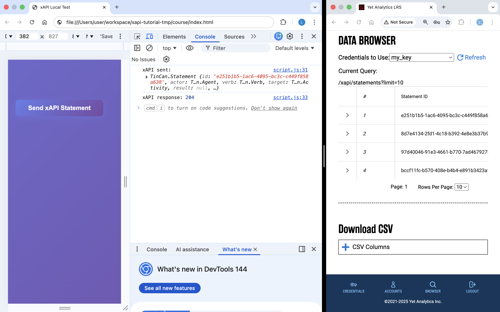

# xApi Tutorial

## Table of Contents

- [Overview](#overview)
- [Engage with course](#engage-with-course)
- [Start Server (LRS)](#start-server-lrs)
- [Mocked](#mocked)
- [LRSQL](#lrsql)

## Overview

This project simulates a course webapge (FE) and its LMS (LRS) backend, communicating through xapi.

Two version of the server backend:
- A mock fastapi server
- A proper LRS with LRSQL (image below).

<br>




## Engage with course

0. Set your credentials in [.env.example](.env.example) and run
    ```bash
    cp .env.example .env
    ```

1. Start an LRS server following [Mocked](#mocked) or [LRSQL](#lrsql)

2. Open [course/index.html](course/index.html) in the browser and see the information being received by the server.


## Start Server (LRS)
### Mocked


```bash
make server_mock
```

Notes:
- XApi payload shown in logs.
- Requires python and `uv` (ex `brew install uv`)

### LRSQL

[Repo LRSSQL](https://github.com/yetanalytics/lrsql?tab=readme-ov-file)

1. Run [(as per docker instrucitons)](https://github.com/yetanalytics/lrsql/blob/main/doc/docker.md)
    ```bash
    make server_lrs
    ```

2. Navigate to [http://0.0.0.0:8080/](http://0.0.0.0:8080/)

3. Login with the credentials in [.env](.env).


